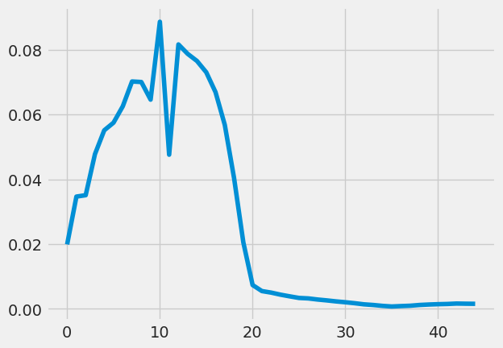
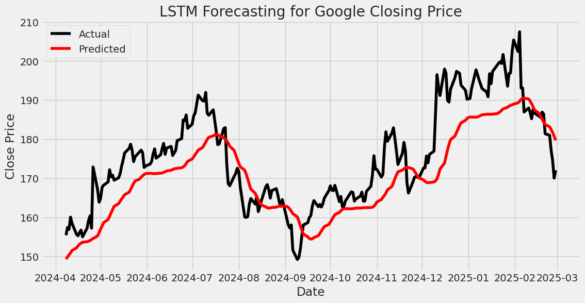

# 📈 Stock Market Analysis and Forecasting

### 🏆 **Project Overview**
This project focuses on **time series analysis** and **forecasting** for stock market prices using **AR, MA, ARIMA and LSTM (Long Short-Term Memory) networks**. Analysis of stocks of Amazon, Google, Microsoft and Nvidia. The model predicts future stock prices based on historical data.

---

## 📌 **Features**  
✅ Data preprocessing (scaling, sequence creation)  
✅ LSTM-based deep learning model for stock price prediction  
✅ Model training, evaluation, and visualization  
✅ Rolling forecast validation and comparison with ARIMA models  
✅ Loss curve analysis and architectural improvements   

---

## 📊 **Dataset & Preprocessing**  
- Stock market data is obtained from [Yahoo Finance](https://finance.yahoo.com). (`yfinance` python module used)
- Features used: **Close Price**, **Scaled Values**, and **Log Transformed Values**.  
- Data is split into **training** and **testing** sets.  
- **MinMax Scaling** is applied to normalize input features.  
- **Sliding window approach** is used to create input sequences for LSTM.

---

## 🏗️ **Model Architecture**  
The LSTM model consists of:  
- **3 LSTM layers** with **256 hidden units**  
- **Layer Normalization** for stable training  
- **Fully connected (Dense) layer** for final prediction  
- **Dropout (0.4) for regularization**  

**Code Snippet (LSTM Model):**  
```python
class LSTMModel(nn.Module):
    def __init__(self, input_size=1, hidden_size=256, num_layers=3, output_size=1):
        super(LSTMModel, self).__init__()
        self.hidden_size = hidden_size
        self.num_layers = num_layers
        self.lstm = nn.LSTM(input_size=1, hidden_size=hidden_size, num_layers=num_layers, batch_first=True, dropout=0.4)
        self.layer_norm = nn.LayerNorm(hidden_size)
        self.fc = nn.Linear(hidden_size, output_size)

    def forward(self, x):
        h0 = torch.zeros(self.num_layers, x.size(0), self.hidden_size).to(x.device)
        c0 = torch.zeros(self.num_layers, x.size(0), self.hidden_size).to(x.device)
        out, _ = self.lstm(x, (h0, c0))
        out = self.layer_norm(out)
        return self.fc(out[:, -1, :])
```

---

## 🎯 **Evaluation Metrics**  
- **Root Mean Square Error (RMSE)**  
- **Loss Curve Analysis**  

**Rolling Forecast RMSE Comparison:**  
| Model          | RMSE  |  
|---------------|------|  
| AR(1)        | 3.016 |  
| MA(2) (d=1)  | 3.022 |  
| ARIMA(1,1,2) | 3.025 |  
| ARIMA(3,1,3) | 7.088 |  
| LSTM     | 8.368 |  
||  


## 📈 **Results & Visualization**  
- **Loss Curve:**  
  - The loss curve shows a rapid decrease initially, then stabilizes.  
  
  - Further tuning may be required to reduce overfitting.  
- **Prediction vs Actual Prices:**  
  - Visualizes model performance over time.  
  
***